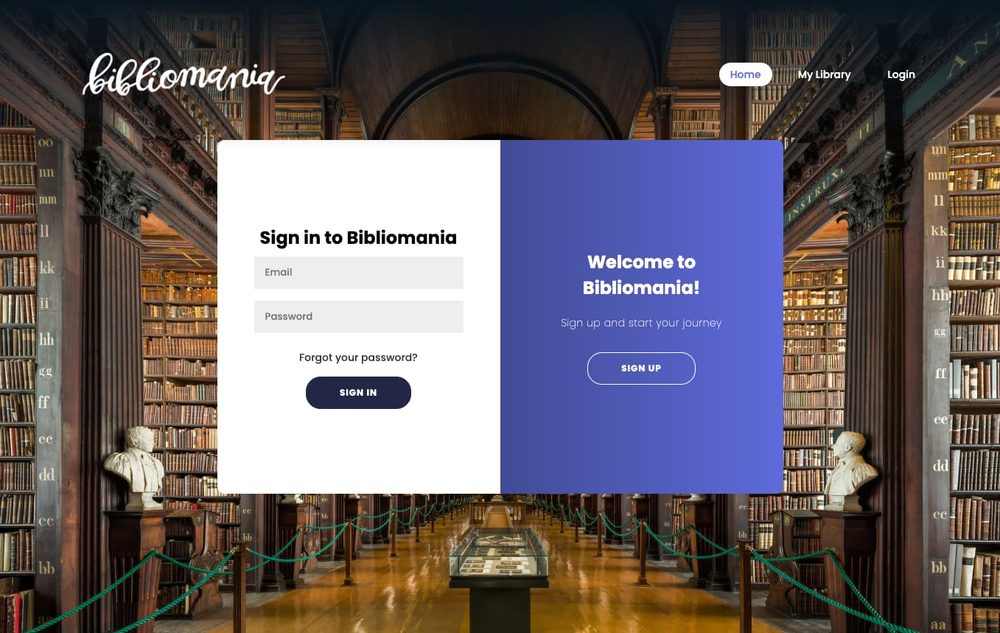
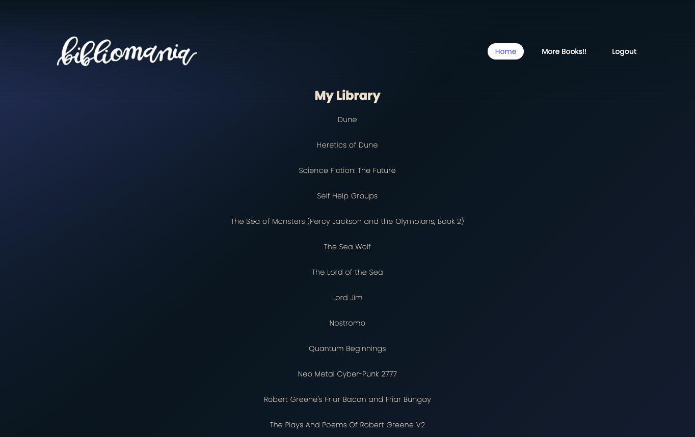

# Bibliomania


## Description

This is a full-stack application that utilizes Node.js and Express.js to create a RESTful API. I uses handlebars.js as its templating engine, MySQL and the Sequelize ORM as the database. It is a live app deployed to Heroku. It accepts and responds to user input.

## Table of Contents

- [Credits](#credits)
- [Background](#background)
- [Technology](#technology)
- [Usage](#usage)
- [Installation](#installation)
- [Contribution](#contribution)
- [License](#license)
- [Questions](#questions)

## Credits

This project is a collaborative and original work by Ana Bennett, Joe Brigantino, Dallas Sybrowsky, and Risvi Tareq. More of our work is available on GitHub at the links below:

- [Ana Bennett](https://github.com/Sydneychick2748)
- [Joe Brigantino](https://github.com/brigantinojoe)
- [Dallas Sybrowsky](https://github.com/DallasSybrowsky)
- [Risvi Tareq](https://github.com/ivsir)

## Background

In designing Bibliomania we wanted to design a user experience that would provide a new and exciting way to search for books to read. In order to meet that goal we designed the following user story:

    WHEN a user arrives at the site for the first time
    THEN the user is presented with an option to Signup or Login on the navbar.
    WHEN the user clicks the signup button
    THEN the user is able to signup with a username and password.
    WHEN the user completes the signing up or login
    THEN the user is taken to their personal dashboard.
    WHEN the user is on their personal dashboard
    THEN the user sees a random book suggestion.
    WHEN the user selects the option to search for more books
    THEN the user is taken to a book swipe page that randomly chooses a book they can like or dislike.
    WHEN the user dislike a book
    THEN the search will render a new book.
    WHEN the user likes a book
    THEN the book will be added to their library.
    WHEN the user is logged in
    THEN the user is given the option to logout.
    WHEN the user logs out
    THEN the user is taken back to the homepage.

## Technology

The technologies utilized in this project are as follows:

- Node.js
- Express.js
- Handlebars.js
- MySQL & Sequelize ORM
- GET & POST Routes (for retrieval and addition of data)

## Usage

This is a web app designed to suggest new books to users and allow them to keep a list of books they'd like to read. Simply sign up to the site, and start browsing.

Please navigate to the live app by clicking [here](https://bibliomania.herokuapp.com/).

Screenshots of the site are pictured below:

Landing/Home Page:


Log In/Sign Up Page:



Book Search/Swipe Page:


User Library Page:



## Installation

No dependencies are required to run the app as deployed on Heroku, however should you desire to run the app locally you must install the dependencies listed in the package.json file. This can be done by running the command:

```
 npm i
```

## Contribution

Should you desire to contribute to this project, please contact any of us at our email addresses listed below.

## License

This application is protected under the MIT license. For detailed licensing information please refer to the MIT license information.

## Questions

If you have any questions, you may contact us directly at:

- [Ana Bennett](anabennett77@gmail.com)
- [Joe Brigantino](brigantinojoe71@gmail.com)
- [Dallas Sybrowsky](dallas.sybrowsky@gmail.com)
- [Risvi Tareq](ivsirqerat@gmail.com)
